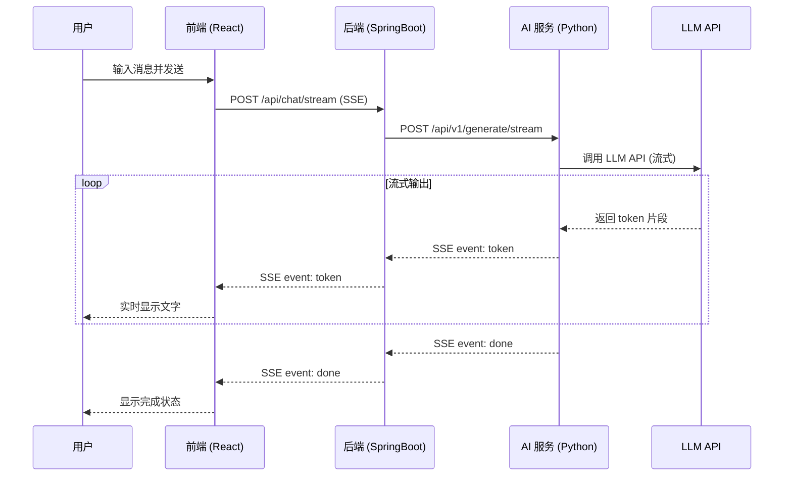
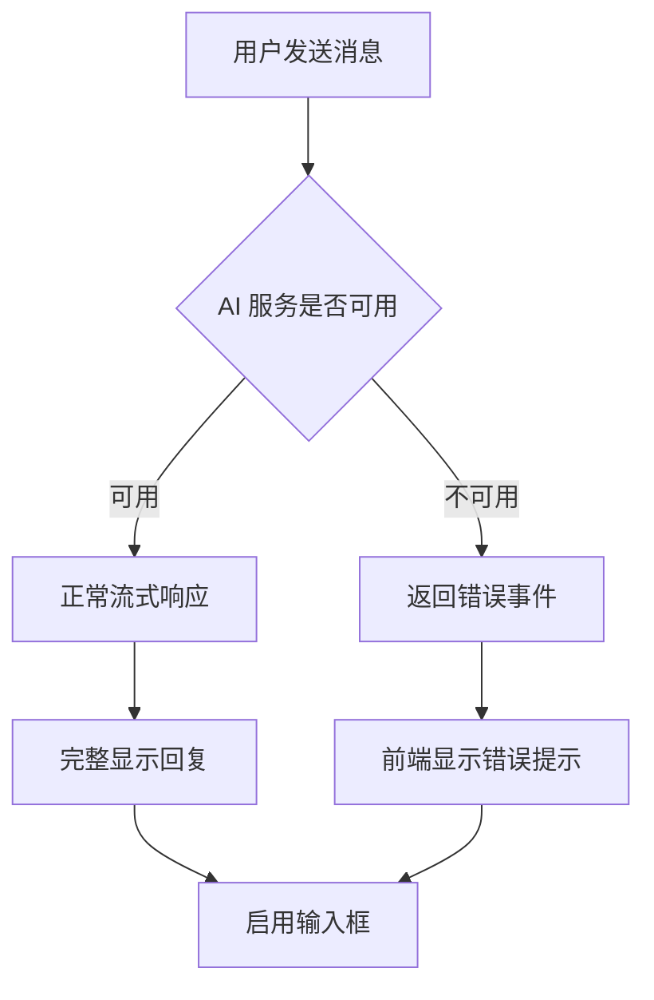

# AI Agent 对话系统 V0.1 - 技术设计文档

**版本**: V0.1  
**创建日期**: 2026-05-06  
**关联需求**: [requirements.md](./requirements.md)

---

## 1. 技术选型

### 1.1 整体架构

```
┌─────────────┐      ┌──────────────┐      ┌─────────────┐
│   前端      │      │   后端       │      │  AI 服务    │
│   (React)   │ ───> │ (SpringBoot) │ ───> │  (Python)   │
│             │ <─── │              │ <─── │             │
└─────────────┘  SSE └──────────────┐ SSE └─────────────┘
         WebSocket/                  HTTP Stream
```

### 1.2 技术栈

| 模块 | 技术栈 | 版本 | 说明 |
|------|--------|------|------|
| **前端** | React | 18.x | 组件化开发 |
| | Vite | 5.x | 构建工具 |
| | TypeScript | 5.x | 类型安全 |
| | Tailwind CSS | 3.x | 样式框架 |
| | react-markdown | 9.x | Markdown 渲染 |
| **后端** | Spring Boot | 3.x | Web 框架 |
| | Kotlin | 1.9.x | 开发语言 |
| | WebFlux | 6.x | 响应式流式处理 |
| **AI 服务** | Python | 3.10+ | 开发语言 |
| | FastAPI | 0.100+ | Web 框架 |
| | LangGraph | 0.0.x | 状态图架构 |
| | SSE Starlette | 1.x | 流式响应 |

---

## 2. 系统架构设计

### 2.1 前端架构

```
src/
├── components/
│   ├── ChatMessage.tsx        # 消息气泡组件
│   ├── ChatInput.tsx          # 输入框组件
│   ├── MessageList.tsx        # 消息列表组件
│   └── TypingEffect.tsx       # 打字机效果组件
├── hooks/
│   ├── useChat.ts             # 对话逻辑 Hook
│   └── useStream.ts           # SSE 流式接收 Hook
├── services/
│   └── api.ts                 # API 调用封装
├── types/
│   └── chat.ts                # TypeScript 类型定义
├── App.tsx
└── main.tsx
```

### 2.2 后端架构

```
main/kotlin/com/example/aichat/
├── controller/
│   └── ChatController.kt      # SSE 端点
├── service/
│   └── ChatService.kt         # 对话转发服务
├── client/
│   └── AIClient.kt            # AI 服务 HTTP 客户端
├── config/
│   └── WebFluxConfig.kt       # WebFlux 配置
└── Application.kt
```

### 2.3 AI 服务架构

```
ai_service/
├── main.py                    # FastAPI 入口
├── graph/
│   ├── state.py               # 状态定义
│   ├── nodes.py               # 节点逻辑
│   └── graph.py               # 状态图编排
├── llm/
│   └── provider.py            # LLM 提供者封装
└── config.py                  # 配置管理
```

---

## 3. 接口设计

### 3.1 前端 ↔ 后端接口

**接口**: `POST /api/chat/stream`  
**协议**: SSE (Server-Sent Events)

**请求**:
```typescript
interface ChatRequest {
  message: string;           // 用户消息
  conversationId?: string;   // 会话 ID（可选，用于上下文）
}
```

**响应** (SSE 流式):
```
event: token
data: {"content": "你"}

event: token
data: {"content": "好"}

event: token
data: {"content": "，"}

event: done
data: {"conversationId": "uuid-123"}
```

**错误响应**:
```
event: error
data: {"error": "AI 服务繁忙，请稍后再试"}
```

### 3.2 后端 ↔ AI 服务接口

**接口**: `POST /api/v1/generate/stream`  
**协议**: HTTP + Streaming Response

**请求**:
```json
{
  "message": "用户的提问",
  "conversation_id": "uuid-123",
  "stream": true
}
```

**响应** (Stream):
```json
// 每个 chunk
{"token": "你"}
{"token": "好"}
{"token": "，"}
```

---

## 4. 核心模块详细设计

### 4.1 前端流式处理

```typescript
// hooks/useStream.ts
export function useStream() {
  const [content, setContent] = useState('');
  const [isLoading, setIsLoading] = useState(false);

  const startStream = async (message: string) => {
    setIsLoading(true);
    setContent('');
    
    const response = await fetch('/api/chat/stream', {
      method: 'POST',
      headers: { 'Content-Type': 'application/json' },
      body: JSON.stringify({ message }),
    });

    const reader = response.body?.getReader();
    const decoder = new TextDecoder();

    while (true) {
      const { done, value } = await reader!.read();
      if (done) break;

      const chunk = decoder.decode(value);
      const lines = chunk.split('\n');

      for (const line of lines) {
        if (line.startsWith('data: ')) {
          const data = JSON.parse(line.slice(6));
          if (data.content) {
            setContent(prev => prev + data.content);
          }
        }
      }
    }

    setIsLoading(false);
  };

  return { content, isLoading, startStream };
}
```

### 4.2 后端流式转发 (Kotlin + WebFlux)

```kotlin
// controller/ChatController.kt
@RestController
@RequestMapping("/api/chat")
class ChatController(
    private val chatService: ChatService
) {
    @PostMapping("/stream", produces = [MediaType.TEXT_EVENT_STREAM_VALUE])
    fun streamChat(@RequestBody request: ChatRequest): Flux<ServerSentEvent<String>> {
        return chatService.streamChat(request.message)
            .map { token ->
                SseEmitter.event()
                    .event("token")
                    .data("""{"content": "$token"}""")
            }
            .onErrorResume { error ->
                Flux.just(
                    SseEmitter.event()
                        .event("error")
                        .data("""{"error": "AI 服务繁忙，请稍后再试"}""")
                )
            }
    }
}

// service/ChatService.kt
@Service
class ChatService(private val aiClient: AIClient) {
    fun streamChat(message: String): Flux<String> {
        return aiClient.streamGenerate(message)
            .map { response -> response.token }
    }
}

// client/AIClient.kt
@Component
class AIClient(private val webClient: WebClient) {
    fun streamGenerate(message: String): Flux<AIResponse> {
        return webClient.post()
            .uri("http://ai-service:8000/api/v1/generate/stream")
            .bodyValue(GenerateRequest(message = message, stream = true))
            .retrieve()
            .bodyToFlow(AIResponse::class.java)
    }
}
```

### 4.3 AI 服务状态图设计 (Python + LangGraph)

```python
# graph/state.py
from typing import TypedDict, List, Annotated
from langgraph.graph.message import add_messages

class State(TypedDict):
    messages: Annotated[List, add_messages]  # 消息历史
    input: str                                # 用户输入
    output: str                               # AI 输出

# graph/nodes.py
async def llm_node(state: State):
    """LLM 推理节点"""
    llm = ChatOpenAI(streaming=True)
    response = await llm.ainvoke(state["messages"])
    return {"output": response.content}

async def stream_node(state: State, writer):
    """流式输出节点"""
    for chunk in state["output"]:
        writer({"token": chunk})
        await asyncio.sleep(0)  # 让出事件循环

# graph/graph.py
from langgraph.graph import StateGraph, END

def create_agent_graph():
    workflow = StateGraph(State)
    
    # 添加节点
    workflow.add_node("llm", llm_node)
    workflow.add_node("stream", stream_node)
    
    # 定义边
    workflow.set_entry_point("llm")
    workflow.add_edge("llm", "stream")
    workflow.add_edge("stream", END)
    
    return workflow.compile()

# main.py
from fastapi import FastAPI
from sse_starlette.sse import EventSourceResponse

app = FastAPI()
agent_graph = create_agent_graph()

@app.post("/api/v1/generate/stream")
async def stream_generate(request: GenerateRequest):
    async def event_generator():
        async with aiohttp.ClientSession() as session:
            async for chunk in agent_graph.astream(
                {"messages": [("user", request.message)], "input": request.message}
            ):
                if "token" in chunk:
                    yield {"token": chunk["token"]}
    
    return EventSourceResponse(event_generator())
```

---

## 5. 数据流设计

### 5.1 完整数据流



### 5.2 错误处理流程



---

## 6. 配置说明

### 6.1 前端配置

```typescript
// vite.config.ts
export default defineConfig({
  server: {
    port: 3000,
    proxy: {
      '/api': {
        target: 'http://localhost:8080',
        changeOrigin: true,
      },
    },
  },
})
```

### 6.2 后端配置

```yaml
# application.yml
server:
  port: 8080

spring:
  webflux:
    base-path: /api

aichat:
  ai-service-url: http://localhost:8000
```

### 6.3 AI 服务配置

```python
# config.py
from pydantic_settings import BaseSettings

class Settings(BaseSettings):
    llm_api_key: str
    llm_base_url: str
    model_name: str = "gpt-3.5-turbo"
    max_tokens: int = 1000

settings = Settings()
```

---

## 7. 扩展性设计

### 7.1 AI 服务状态图扩展点

当前 V0.1 版本使用简单状态图：
```
用户输入 → LLM 节点 → 流式输出 → 结束
```

V0.2+ 可以扩展为：
```
用户输入 → 意图识别 → [条件分支]
  ├─> 普通对话 → LLM → 输出
  ├─> 搜索查询 → 搜索工具 → LLM → 输出
  ├─> 数据库查询 → 数据库工具 → LLM → 输出
  └─> 代码执行 → 沙箱工具 → LLM → 输出
```

### 7.2 后端扩展点

- **中间件**: 可添加认证、限流、日志中间件
- **消息持久化**: 可添加数据库存储对话历史
- **多会话管理**: 支持多用户并发对话

### 7.3 前端扩展点

- **对话历史**: 添加侧边栏展示历史对话
- **多模型切换**: 允许用户选择不同 AI 模型
- **消息编辑**: 支持编辑已发送的消息

---

## 8. 性能优化

### 8.1 首字响应时间 (TTFT) 优化

| 优化点 | 目标值 | 实现方式 |
|--------|--------|----------|
| 网络延迟 | <100ms | 同地域部署、HTTP/2 |
| 后端转发 | <50ms | WebFlux 响应式、零拷贝 |
| AI 推理 | <2s | LLM 流式 API、预热连接 |
| 前端渲染 | <50ms | 虚拟滚动、增量渲染 |

### 8.2 流式传输优化

- **Buffer 策略**: 收到 token 立即发送，不合并
- **压缩**: 启用 gzip 压缩 SSE 数据
- **连接复用**: Keep-Alive 长连接

---

## 9. 部署架构

### 9.1 本地开发

```
┌─────────────────┐
│   Frontend      │  port: 3000
│   (Vite + React)│
└────────┬────────┘
         │ proxy /api
┌────────▼────────┐
│   Backend       │  port: 8080
│   (SpringBoot)  │
└────────┬────────┘
         │ HTTP
┌────────▼────────┐
│   AI Service    │  port: 8000
│   (FastAPI)     │
└─────────────────┘
```

### 9.2 生产环境

```
┌─────────────────┐
│  Nginx / LB     │  port: 443 (HTTPS)
└────────┬────────┘
         │
    ┌────┴────┐
    │         │
┌───▼──┐ ┌───▼──┐
│ FE-1 │ │ FE-2 │  前端集群
└──────┘ └──────┘

┌─────────────────┐
│  Backend Pod    │  K8s Deployment
└─────────────────┘

┌─────────────────┐
│  AI Service Pod │  K8s Deployment
└─────────────────┘
```

---

## 10. 测试计划

### 10.1 单元测试

| 模块 | 测试框架 | 覆盖率目标 |
|------|----------|------------|
| 前端 | Vitest + RTL | 80% |
| 后端 | JUnit 5 | 85% |
| AI 服务 | pytest | 80% |

### 10.2 集成测试

- **端到端测试**: Playwright 测试完整对话流程
- **流式测试**: 验证 SSE 数据正确传输
- **错误测试**: 模拟 AI 服务宕机场景

### 10.3 性能测试

- **压测工具**: k6 / JMeter
- **指标**:
  - 并发用户数: 100+
  - P95 首字延迟: <3s
  - 错误率: <1%

---

## 11. 风险与应对

| 风险 | 可能性 | 影响 | 应对措施 |
|------|--------|------|----------|
| LLM API 不稳定 | 中 | 高 | 添加重试机制、降级到备用模型 |
| 流式中断 | 低 | 中 | 前端自动重连、错误提示 |
| Markdown 渲染 XSS | 低 | 中 | 使用 sanitize-html 过滤 |
| 并发性能瓶颈 | 中 | 中 | 性能测试、水平扩展 |

---

## 12. 里程碑

| 阶段 | 时间 | 交付物 |
|------|------|--------|
| **Phase 1** | Week 1 | 前端基础 UI 完成 |
| **Phase 2** | Week 2 | 后端 SSE 接口完成 |
| **Phase 3** | Week 3 | AI 服务状态图完成 |
| **Phase 4** | Week 4 | 全链路联调、测试、部署 |

---

## 附录

### A. 依赖版本锁定

- Node.js: 20.x
- JDK: 17
- Python: 3.10

### B. 关键依赖

**前端**:
```json
{
  "react": "^18.2.0",
  "react-markdown": "^9.0.1",
  "remark-gfm": "^4.0.0"
}
```

**后端**:
```kotlin
dependencies {
    implementation("org.springframework.boot:spring-boot-starter-webflux")
    implementation("com.fasterxml.jackson.module:jackson-module-kotlin")
}
```

**AI 服务**:
```
fastapi>=0.100.0
langgraph>=0.0.1a1
sse-starlette>=1.6.0
```
