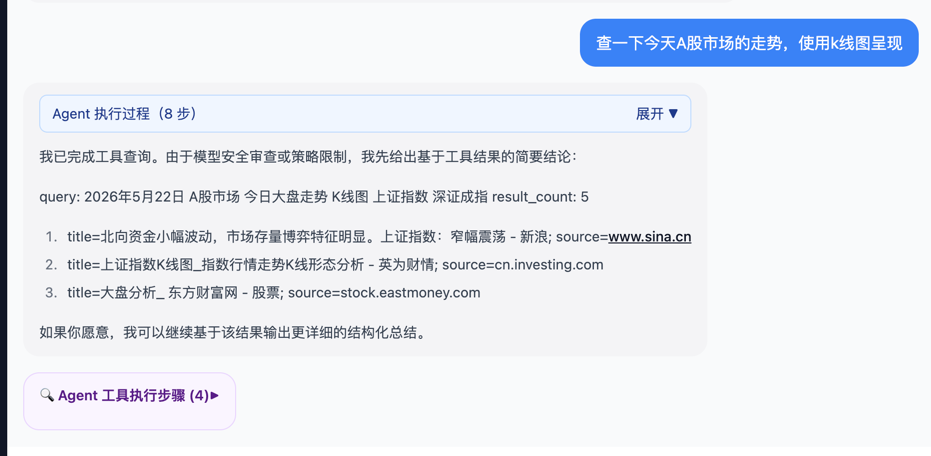

# 多 Agent 平台架构蓝图（V0.2 -> V2.0）

> 目标：把当前项目从“单 Agent + 少量工具”演进为“多 Agent + RAG + MCP + Skills + 沙盒执行”的可扩展平台，避免写死逻辑与临时适配。

---

## 1. 背景与目标

### 1.1 当前痛点
- 工具分支与事件处理逻辑较“写死”，随着工具数量增长会产生分支爆炸。
- Agent 决策、工具执行、SSE 编排耦合在路由/节点里，职责边界不清。
- 缺乏统一的领域抽象（Agent/Skill/Tool/Memory/Policy/Execution），后续接入 RAG/MCP/Sandbox 成本高。
- 缺乏标准化评测与可观测闭环，稳定性问题难系统治理。

### 1.2 平台终态能力（V2.0）
- 多 Agent 编排（Plan/Research/Writer/Coder/Reviewer/Executor）。
- RAG 全链路（索引构建、检索、重排、引用溯源、上下文预算）。
- MCP 统一接入（远端工具生态，权限隔离，动态发现）。
- Skills 市场化扩展（可版本化、可热插拔、可灰度）。
- 沙盒命令执行（受限网络/文件系统/资源配额/审计）。
- 统一可观测、评测、治理、安全与回滚机制。

---

## 2. 架构设计原则（业界通用）

- **能力插件化**：Tool/Skill/MCP Connector 全部通过注册与契约接入，不在核心流程硬编码。
- **编排与执行分离**：Planner 负责“做什么”，Executor 负责“怎么做”。
- **事件驱动优先**：内部统一领域事件，SSE 只是外部投影。
- **协议稳定优先**：向后兼容，版本化事件与数据模型。
- **安全默认开启**：工具权限、命令执行、外部连接均需 policy gate。
- **可观测先行**：每次调用都带 trace/span/agent_id/turn_id。
- **评测驱动迭代**：每个版本必须有离线评测 + 在线质量指标。

---

## 3. 分层架构蓝图

## L0 接入层（API/BFF/UI）
- 前端：消息渲染、工具过程、图表/结构化卡片、会话管理。
- BFF：会话鉴权、限流、兼容透传、审计注入。
- AI Service API：流式事件输出、请求校验、会话路由。

## L1 编排层（Orchestration）
- `Conversation Orchestrator`：回合生命周期管理。
- `Planner`：任务拆解（可由 LLM planner 或规则 planner 实现）。
- `Router`：选择单 Agent 或多 Agent 协作策略。
- `Supervisor`：控制预算、迭代次数、超时、终止条件。

## L2 Agent Runtime 层
- `Agent` 抽象：输入/上下文/目标/输出契约。
- `Reasoning Policy`：ReAct、Plan-Execute、Self-Refine、Debate 等策略可替换。
- `Memory Adapter`：短期/长期记忆读写。
- `Capability Resolver`：动态解析可用 Tool/Skill/MCP。

## L3 Capability 层
- `Tool`：原子能力（search/time/http/sql/...）。
- `Skill`：组合能力（可调用多个 Tool/Agent，带业务语义）。
- `MCP Connector`：外部能力桥接（标准协议 + 权限映射）。
- `Sandbox Executor`：命令执行、代码运行、文件操作（强隔离）。
- `RAG Service`：索引、检索、重排、上下文拼装、引用。

## L4 平台基础设施层
- `State Store`：会话状态、事件日志、检查点。
- `Vector Store`：向量索引与 metadata 过滤。
- `Object Store`：文档分片、中间产物、执行日志。
- `Observability`：Tracing/Metrics/Logs/Prompt&Tool 审计。
- `Policy Engine`：权限、敏感词、数据外发与命令白名单。

---

## 4. 核心领域抽象（解耦关键）

### 4.1 AgentSpec
```text
id, name, role, model_profile, policies, capabilities, memory_profile
```

### 4.2 Capability（统一 Tool/Skill/MCP）
```text
name, version, kind(tool|skill|mcp), input_schema, output_schema,
permissions, timeout_ms, retry_policy, cost_profile
```

### 4.3 ExecutionContext
```text
conversation_id, turn_id, trace_id, span_id, agent_id,
budget(tokens/time/cost), user_profile, feature_flags
```

### 4.4 PlanStep
```text
step_id, owner_agent, action_type(call_capability|delegate|respond),
input, expected_output, stop_condition
```

### 4.5 MemoryRecord
```text
scope(short|long|session|user), key, value, embedding, ttl, source
```

### 4.6 PolicyDecision
```text
allow|deny|redact|sandbox_only + reason + policy_id
```

---

## 5. 事件与状态模型（统一协议）

### 5.1 内部领域事件（建议）
- `turn.started`
- `agent.selected`
- `plan.created`
- `capability.requested`
- `capability.succeeded`
- `capability.failed`
- `memory.read`
- `memory.write`
- `response.delta`
- `response.final`
- `turn.completed`

### 5.2 外部流式事件（SSE投影）
- 兼容现有：`token`, `tool_start`, `tool_result`, `tool_summary`, `error`
- 新增标准：`agent_step`, `skill_start`, `skill_result`, `rag_context`, `chart_data`, `chart_error`

### 5.3 事件信封（固定）
```json
{
  "type": "string",
  "schemaVersion": "1.0",
  "conversationId": "string",
  "turnId": "string",
  "agentId": "string",
  "traceId": "string",
  "spanId": "string",
  "timestamp": 0,
  "payload": {}
}
```

> 规则：所有新增能力只在 `payload` 扩展，不新增散乱顶层字段。

---

## 6. 调度与编排策略（多 Agent）

### 6.1 三种编排模式
- **Router 模式**：按任务类型路由到专用 Agent（最快）。
- **Planner-Executor 模式**：Planner 拆任务，Executor 执行步骤（最稳）。
- **Supervisor-Workers 模式**：Supervisor 监工，多 Worker 并行（最强）。

### 6.2 推荐落地顺序
1. 先 Router（低风险）
2. 再 Planner-Executor（核心）
3. 最后 Supervisor-Workers（多 Agent 并发）

### 6.3 终止与预算控制
- 每回合限制：`max_iterations`, `max_tool_calls`, `max_tokens`, `max_latency_ms`, `max_cost`。
- 触发策略：超预算自动降级（停止工具、输出基于现有证据的结论）。

---

## 7. RAG 架构方案

### 7.1 数据管道
- Ingestion -> Chunking -> Embedding -> Indexing -> Metadata tagging

### 7.2 在线检索流程
1. Query rewrite
2. Hybrid retrieval（BM25 + Vector）
3. Rerank（cross-encoder 可选）
4. Context packing（token budget aware）
5. Citation generation（来源可追溯）

### 7.3 关键技术细节
- Chunk 粒度：300-800 tokens，可重叠 10-20%。
- TopK 分层：粗召回 K=40，重排 K=8，最终注入 K=4。
- 每段证据带 `source_id/url/title/snippet_span`。
- 回复必须附引用（可配置 strict/relaxed）。

---

## 8. MCP 接入架构

### 8.1 Connector 设计
- `MCPRegistry`：维护可用 MCP server 列表与元数据。
- `MCPAdapter`：把 MCP tool schema 转为平台 Capability。
- `Permission Mapper`：用户/租户权限映射到 MCP 操作权限。

### 8.2 调用流程
- Agent 选能力 -> CapabilityResolver 命中 MCP -> Policy Gate -> MCP 调用 -> 结果规范化 -> 事件输出。

### 8.3 安全要求
- MCP server 白名单。
- OAuth/API Key 分租户隔离。
- 结果大小与字段过滤，防止 prompt 注入回流。

---

## 9. Skills 体系设计

### 9.1 Skill 定义
Skill = 可复用工作流模板：
- 输入 Schema
- 前置校验
- 步骤 DAG
- 依赖能力清单（tools/mcp/rag/sandbox）
- 输出 Schema
- 失败补偿逻辑

### 9.2 Skill 生命周期
- `draft -> validated -> released -> deprecated`
- 支持版本：`skill_name@semver`
- 支持灰度：按租户/用户/流量百分比分配版本

---

## 10. 沙盒命令执行架构

### 10.1 执行模型
- `Sandbox Broker`（调度） + `Sandbox Worker`（执行）
- 每次执行独立容器/微虚机会话，执行后销毁。

### 10.2 隔离策略
- 文件系统：只读基础镜像 + 限制挂载目录。
- 网络：默认禁网，按 policy 选择性放行域名。
- 资源：CPU/Mem/Time/Process 数量上限。
- 命令：白名单 + 参数校验 + shell 注入拦截。

### 10.3 审计与回放
- 全量记录：命令、输入、输出、退出码、资源消耗、trace。
- 可回放但不可篡改（append-only 日志）。

---

## 11. 数据存储与状态管理

### 11.1 建议存储拆分
- 会话状态：PostgreSQL（事务 + 查询能力）
- 向量检索：pgvector / Milvus / Weaviate（按规模选）
- 事件日志：ClickHouse / OpenSearch（按观测需求选）
- 对象内容：S3/MinIO（文档与产物）

### 11.2 检查点机制
- 每个 `turn` 至少一个 checkpoint。
- tool/skill/sandbox 完成后强制 checkpoint，便于失败恢复与重放。

---

## 12. 安全与治理

- **输入防护**：Prompt Injection 检测、敏感数据识别、参数校验。
- **输出防护**：PII 脱敏、机密信息防泄漏、策略拒答。
- **能力防护**：最小权限、租户隔离、操作审计、配额限流。
- **供应链防护**：技能包签名、依赖漏洞扫描、镜像签名验证。

---

## 13. 可观测与评测体系

### 13.1 可观测（必须）
- Trace：每次 turn 的端到端链路。
- Metrics：latency、success_rate、tool_error_rate、hallucination_proxy。
- Logs：结构化日志，关联 trace_id。

### 13.2 评测（版本门禁）
- 离线集：工具调用正确率、RAG 引用准确率、拒答合规率。
- 在线集：用户满意度、重试率、异常率、时延分位数（P95/P99）。
- 每版本设定 SLO，未达标不进入下一阶段。

---

## 14. CI/CD 与工程规范

- Monorepo 分层测试：unit -> integration -> e2e -> load。
- PR 门禁：类型检查、静态扫描、安全扫描、契约测试。
- 发布策略：canary（5% -> 25% -> 100%）+ feature flags。
- 一键回滚：关闭新能力开关，保留基础对话路径。

---

## 15. 版本迭代路线图（详细）

## V0.3（架构地基）
**目标**：消除写死逻辑，建立统一事件与能力契约。
- 统一 `EventEnvelope` 与 `Capability` 抽象。
- 将 route 中事件拼装抽到 `event_mapper`。
- ToolRegistry 增加 schema/timeout/retry/policy 元信息。

**验收标准**
- 新增工具无需改动核心分支，仅注册即可被调用。
- SSE 事件全部通过统一 envelope 输出。

## V0.4（Router 多 Agent）
**目标**：支持基于任务类型的多 Agent 路由。
- 增加 `AgentRegistry`、`RouterAgent`。
- 引入 `agent_id` 维度的事件与日志。

**验收标准**
- 至少 3 个专用 Agent（General/Research/Code）可路由。
- 路由命中率与失败回退策略可观测。

## V0.5（RAG MVP）
**目标**：实现可用 RAG。
- 文档入库流程 + Hybrid retrieval + 引用回传。
- 响应附来源摘要与可点击引用。

**验收标准**
- 已知问题集上，引用准确率达到预设阈值（如 >= 85%）。
- 无引用时触发降级提示，不伪造来源。

## V0.6（Skills 引擎）
**目标**：能力组合化。
- Skill DSL（YAML/JSON）+ Skill Runtime。
- 支持步骤 DAG、错误补偿、版本灰度。

**验收标准**
- 上线至少 5 个可复用 Skills。
- Skill 升级不影响历史版本调用。

## V0.7（MCP 集成）
**目标**：接入外部能力生态。
- MCPRegistry + Adapter + 权限映射。
- 租户维度凭据管理与审计日志。

**验收标准**
- 至少接入 2 个 MCP server。
- 拒绝未授权 MCP 操作，审计链路完整。

## V0.8（沙盒执行）
**目标**：安全命令执行能力。
- Sandbox Broker/Worker + policy gate + 限制策略。
- 命令执行事件化与产物回传。

**验收标准**
- 受控命令可执行，越权命令必拦截。
- 执行可追踪、可审计、可回放。

## V1.0（平台稳定版）
**目标**：形成可生产部署的统一平台。
- 统一策略引擎、配额系统、观测仪表盘。
- 性能与稳定性优化（缓存、并发、背压）。

**验收标准**
- 达成 SLO：成功率、P95、错误率指标达标。
- 灰度发布与回滚流程可演练通过。

## V2.0（多 Agent 协同智能体）
**目标**：Supervisor-Workers 并行协作，支持复杂任务。
- 任务图编排、并行执行、冲突仲裁、结果融合。
- 长周期记忆与跨会话任务追踪。

**验收标准**
- 复杂任务（研究+分析+执行）端到端自动完成率显著提升。
- 多 Agent 成本与延迟在预算内可控。

---

## 16. 建议先做的“第一批规范化改造”

1. 抽象统一 `Capability` 与 `EventEnvelope`（先不加新功能）。
2. 将 `nodes.py` 中工具结果适配拆为 `result_normalizer` 模块。
3. 将 `chat.py` 中事件发送拆为 `event_builder`，路由仅做编排。
4. 引入 `PolicyGate`（最小版）：工具白名单 + 参数校验 + 超时策略。
5. 为每次工具调用补齐 trace_id/span_id，建立最小可观测闭环。

---

## 17. 与当前代码的映射建议

- `graph/nodes.py`
  - 保留 `agent_node/tool_node`，新增 `capability_executor` 适配层。
  - `_sanitize_tool_result_for_prompt` 下沉到 `normalizers/tool_result.py`。

- `api/routes/chat.py`
  - `_stream_data` 升级为标准 envelope builder。
  - route 只负责生命周期，不直接判断业务类型。

- `tools/registry.py`
  - 增加 capability 元数据（schema、policy、timeout、retries、cost）。

- `graph/state.py`
  - 加入 `trace_id/turn_id/active_agent/budget` 字段。

---

## 18. 决策清单（你确认后执行）

1. 版本节奏：按本文 v0.3 -> v1.0 逐步推进，还是合并阶段快速迭代？
2. RAG 首选存储：`pgvector`（简化运维）还是独立向量库（高扩展）？
3. 沙盒方案：Docker 隔离先行，还是直接 microVM（更安全）？
4. MCP 接入优先级：先工具化内建能力，还是尽早接外部 MCP 生态？
5. 是否在 V0.3 就引入 feature flags 与 canary 发布流程（建议是）？

> 你确认后，我将按该蓝图给出“V0.3 的逐文件改造任务清单（精确到文件、接口、测试用例）”，然后再分阶段实施。

